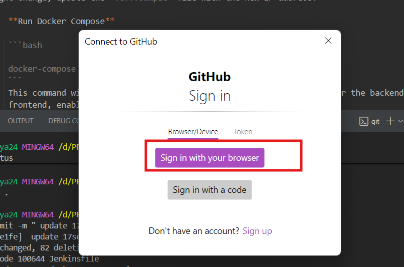

# Pushing a Local Git Repository to Remote for the First Time

This guide explains how to push your local Git repository to a remote repository for the first time. When you do this, Git may prompt you for your credentials.

## Steps

1. **Initialize your local repository (if not already done):**
    ```bash
    git init
    ```

2. **Add your remote repository:**
    ```bash
    git remote add origin <remote-repo-url>
    ```

3. **Add files and commit:**
    ```bash
    git add .
    git commit -m "Initial commit"
    ```

4. **Push to remote:**
    ```bash
    git push -u origin main
    ```
    > Replace `main` with your branch name if different.

5. **Credential Prompt:**
    When you push for the first time, Git will ask for your username and password (or a personal access token).

    

## Tips

- For GitHub, use a [personal access token](https://github.com/settings/tokens) instead of your password.
- You can cache your credentials using:
  ```bash
  git config --global credential.helper cache
  ```

- For more secure and convenient authentication, consider [setting up SSH keys](https://docs.github.com/en/authentication/connecting-to-github-with-ssh).
